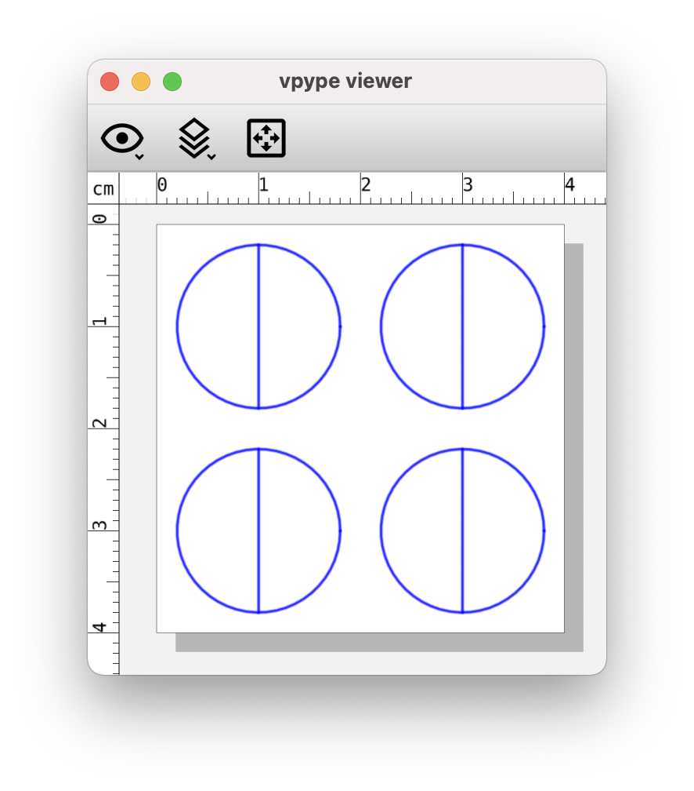
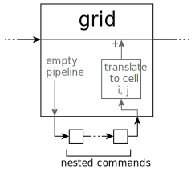
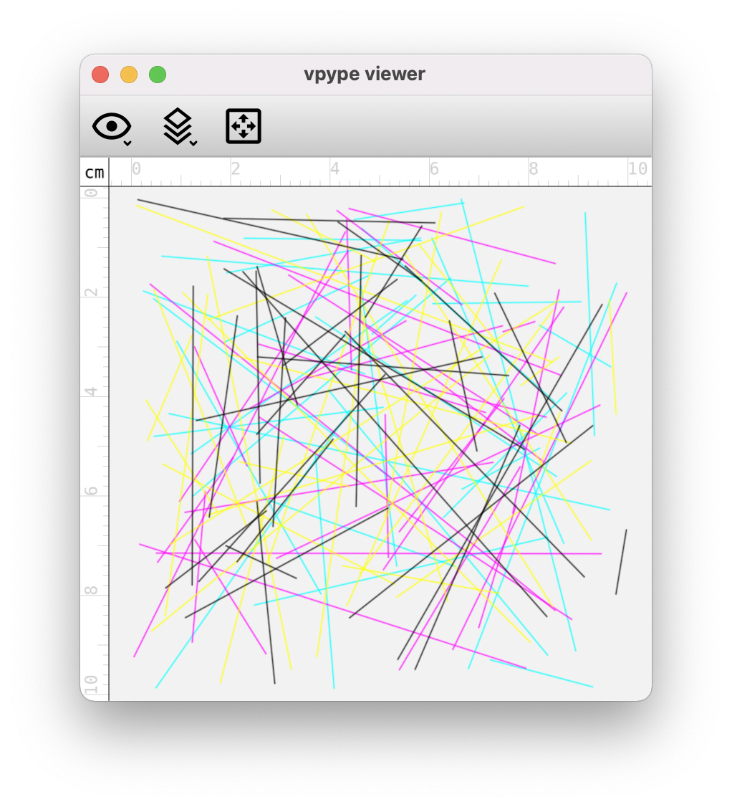
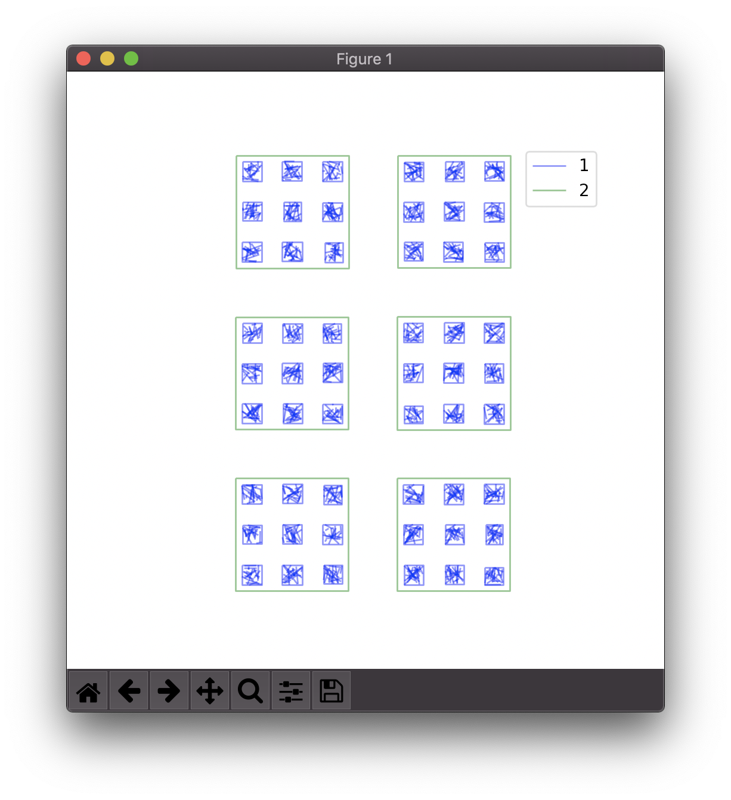

.. _fundamentals:

============
Fundamentals
============

.. highlight:: bash

.. _fundamentals_pipeline:

Pipeline
========

To use *vpype*, you compose 'pipelines' of 'commands'. In a given pipeline, geometries are passed from command to command, starting with the first all the way to the last.

.. image:: images/pipeline.svg

Pipelines are created by passing *vpype* the first command name together with its options and arguments, then the next command name, and so on.::

  $ vpype command1 [--option X [...]] [ARG [...]] command2 [--option X [...]] [ARG [...]] ...

The list of every command is available by running the help option on the core vpype command::

  $ vpype --help
  Usage: vpype [OPTIONS] COMMAND1 [ARGS]... [COMMAND2 [ARGS]...]...

  Options:
    -v, --verbose
    -I, --include PATH  Load commands from a command file.
    -H, --history       Record this command in a `vpype_history.txt` in the
                        current directory.
    -s, --seed INTEGER  Specify the RNG seed.
    --help              Show this message and exit.
      ...

Help on each command is also available by running the help option on that command, for example::

  $ vpype circle --help
  Usage: vpype circle [OPTIONS] X Y R

    Generate lines approximating a circle.

    The circle is centered on (X, Y) and has a radius of R.

  Options:
    -q, --quantization LENGTH  Maximum length of segments approximating the
                               circle.
    -l, --layer LAYER          Target layer or 'new'.
    --help                     Show this message and exit.

.. _fundamentals_lines_layers:

Lines and layers
================

.. figure:: images/layers.svg
   :figwidth: 300px
   :align: right

The geometries passed from command to command are organised as a collection of layers, each containing a collection of paths.

The primary purpose of layers in *vpype* is to create or process files for multicolored plots, where each layer contains geometries to be drawn with a specific pen or color. In *vpype*, layers are identified by a non-zero, positive integer (e.g. 1, 2,...). You can have as many layers as you want, memory permitting.

Each layer consists of an ordered collection of paths. In *vpype*, paths are so-called "polylines", meaning lines made of one or more straight segments. Each path is therefore described by a sequence of 2D points. Internally, these points are stored as complex numbers (this is invisible to the user but relevant to :ref:`plugin <plugins>` writers).

Curved paths are not supported *per se*. Instead, curves are converted into linear segments that are small enough to approximate curvature in a way that is invisible in the final plot. For example, the :ref:`cmd_read` command transforms all curved SVG elements (such as circles or bezier paths) into paths made of segments, using a maximum segment size that can be set by the user (so-called "quantization"). This design choice makes *vpype* very flexible and easy to develop, with no practical impact on final plot quality, but is the primary reason why *vpype* is not fit to be (and is not meant as) a general-purpose vector graphics processing tool.

One downside of using polylines to approximate curved element is a potential increase in output file size. For example, three numbers are sufficient to describe a circle, but 10 to 100 segments may be needed to approximate it sufficiently well for plotting. When this becomes an issue, tuning the quantization parameters with the ``-q`` option or using the :ref:`cmd_linesimplify` command can help.

.. _fundamentals_commands:

Command taxonomy
================

Commands come in three different types: *generators*, *layer processors* and *global processors*. Although it is not strictly necessary to understand the difference between them to use *vpype*, it helps to have a good grasp on how they work, and is very useful if you plan on writing your own :ref:`plug-ins <plugins>`.

.. image:: images/command_types.svg
   :width: 600px

.. _fundamentals_generators:

Generators
----------

Generators add new geometries to a target layer, ignoring (but preserving) any content already existing in the layer. Other layers' content is not affected. They accept a ``--layer TARGET`` option to control which layer should receive the new geometries. By default, the target layer of the previous generator command is used, or layer 1 if the generator is the first. Here's an example::

  $ vpype line --layer 3 0 0 1cm 1cm circle 0.5cm 0.5cm 0.3cm

This command will first draw a :ref:`cmd_line` on layer 3 from the point (0,0) a point at (1cm, 1cm), then it will draw a :ref:`cmd_circle` also on layer 3 (defaulting to the target of the previous command) centred on the point (0.5cm, 0.5cm), with a radius of 0.3cm.

For generators, ``--layer new`` can be used to generate geometries in a new, empty layer with the lowest possible number identifier.

A few more examples of generators include:

* :ref:`cmd_rect`: generates a rectangle, with optional rounded angles
* :ref:`cmd_ellipse`: generates lines approximating an ellipse
* :ref:`cmd_arc`: generates lines approximating a circular arc
* :ref:`cmd_frame`: generates a single-line frame around the existing geometries

.. _fundamentals_layer_processors:

Layer processors
----------------

Unlike generators, layer processors generally don't produce new paths but instead modify existing ones on a layer-by-layer basis. This means that the way a layer processor changes one layer's content has no bearing on how it will affect another layer. Let's consider for example :ref:`cmd_linemerge`. This command looks for paths whose ends are close to one another (according to some tolerance) and merges them to avoid unnecessary pen-up/pen-down operations by the plotter. Since :ref:`cmd_linemerge` is a layer processor, it will only merge paths within the same layer.

Layer processors accept a ``--layer TARGET[,TARGET[,...]]`` option to specify one or more layer on which they should be applied. Here are some examples::

  $ vpype [...] crop --layer 1      0 0 10cm 10cm
  $ vpype [...] crop --layer 1,2,4  0 0 10cm 10cm
  $ vpype [...] crop --layer all    0 0 10cm 10cm

All these commands crop the specified layers to a 10cm x 10cm rectangle with a top-left corner at (0,0). If the ``--layer`` option is omitted, then ``all`` is assumed and the layer process will target every single (existing) layer. Note that if you provide a list of layers, they must be comma separated without any whitespace.

A few more examples of layer processors include:

* :ref:`cmd_translate`: apply a translation to the geometries (i.e. move them)
* :ref:`cmd_linesort`: sort paths within the layer in such a way that the distance travelled by the plotter in pen-up position is minimized
* :ref:`cmd_linesimplify`: reduce the number of points in paths while ensuring a specified precision, in order to minimize output file size

.. _fundamentals_global_processors:

Global processors
-----------------

While layer processors are executed multiple times, once for each layer they are targeted to, global processors are executed only once and apply to all layers. Depending on the command, they may or may not have layer-related parameters, although there is no rule about that.

For example, the :ref:`cmd_write` command uses all layers in the pipeline to generate a multi-layer SVG file. The :ref:`cmd_rotate`, :ref:`cmd_scale`, :ref:`cmd_scaleto`, and :ref:`cmd_skew` transformation commands are also implemented as global processors because they use the center of the geometry as reference (by default), although they also accept a `--layer` option which makes them behave much like a layer processor.

.. _fundamentals_units:

Units
=====

Like the SVG format, the default unit used by *vpype* is the CSS pixel, which is defined as 1/96th of an inch. For example, the following command will generate a 1-inch-radius circle centered on coordinates (0, 0)::

  $ vpype circle 0 0 96

Because the pixel is not the best unit to use with physical media, most commands understand other CSS units including ``in``, ``cm``, ``mm``, ``pt`` and ``pc``. The 1-inch-radius circle can therefore also be generated like this::

  $ vpype circle 0 0 1in

Note that there must be no whitespace between the number and the unit, otherwise they would be considered as different command-line arguments.

Internally, units other than CSS pixels are converted as soon as possible and pixels are used everywhere in the code (see :class:`LengthType`).

Likewise, angles are interpreted as degrees by default but alternative units may be specified, including ``deg``, ``rad``, ``grad`` and ``turn``. The following examples all rotate a rectangle by 45 degrees::

  $ vpype rect 0 0 50 100 rotate 45
  $ vpype rect 0 0 50 100 rotate 50grad
  $ vpype rect 0 0 50 100 rotate 0.125turn
  $ vpype rect 0 0 50 100 rotate 0.785398rad

.. _fundamentals_metadata:

Properties
==========

In addition to geometries, the *vpype* pipeline carries metadata, i.e. data that provides information about geometries. This metadata takes the form of *properties* that are either attached to a given layer, or global. Properties are identified by a name and their value can be of arbitrary type (e.g. integer, floating point, color, etc.). There can be any number of global and/or layer properties and it is up to commands (and plug-ins) how they act based (or upon) these properties.

System properties
-----------------

Some properties are referred to as *system properties*. Their name is prefixed with ``vp_`` and they are widely used throughout *vpype*. Currently, the following system properties are defined:

  * ``vp_color``: the color of a layer (layer property)
  * ``vp_pen_width``: the pen width of a layer (layer property)
  * ``vp_name``: the name of a layer (layer property)
  * ``vp_page_size``: the page size (global property)

Many commands acts on these properties. For example, the :ref:`cmd_read` command sets these properties according to the imported SVG file's content. The :ref:`cmd_color`, :ref:`cmd_penwidth`, :ref:`cmd_name`, and :ref:`cmd_pens` commands can set these properties to arbitrary values. In particular, the :ref:`cmd_pens` commands can apply a predefined set of values on multiple layers at once, for example to apply a CMYK color scheme (see :ref:`faq_custom_pen_config` for more information). The page size global property is set by the :ref:`cmd_pagesize` and :ref:`cmd_layout` commands.

SVG attributes properties
-------------------------

The :ref:`cmd_read` command identifies SVG attributes common to all geometries in a given layer and store their value as layer property with a ``svg_`` prefix. For example, if all geometries in a given layer share a ``stroke-dasharray="3 1"`` SVG attribute (either because it is set at the level of the group element, or because it is set in every single geometry elements), a property named ``svg_stroke-dasharray`` with a value of ``"3 1"`` is added to the layer.

These properties are set for informational and extension purposes, and are mostly ignored by *vpype* commands. One exception is the :ref:`cmd_write` command, which can optionally restore these attributes in the exported SVG file.

An example of future extension could be a plug-in which detects the ``svg_stroke-dasharray`` property and turns the corresponding layer's lines into their dashed equivalent. Another example would be a plug-in looking for a ``svg_fill`` property and adding the corresponding hatching patterns to reproduce the filled area.

Interacting with properties
---------------------------

High-level commands such as :ref:`cmd_penwidth` are not the only means of interacting with properties. *vpype* includes a set of low-level commands to inspect and modify global and layer properties:

  * :ref:`cmd_propget`: reads the value of a single global or layer property
  * :ref:`cmd_proplist`: lists all the global or layer properties
  * :ref:`cmd_propset`: sets the value of a given global or layer property
  * :ref:`cmd_propdel`: deletes a given global or layer property
  * :ref:`cmd_propclear`: deletes all global or layer properties

.. _fundamentals_property_substitution:

Property substitution
---------------------

Most arguments and options passed to commands via the *vpype* CLI will apply property substitution on the provided input. For example, this command will draw the name of the layer::

  $ vpype [...] text --layer 1 "{vp_name} layer" [...]

The curly braces indicate that they should be substituted by the content of the property they refer to. In this case, if layer 1 is named "red", the text "red layer" should be drawn by the :ref:`cmd_text` command. Note the use of double quotes. They are needed because curly braces are typically used by shell interpreters such as ``bash`` or ``zsh`` (here, they are also needed to escape the whitespace between ``{vp_name}`` and ``layer``).

To avoid substitution, curly braces can be escaped by doubling them::

  $ vpype [...] text --layer 1 "{{hello}}" [...]   # the text '{hello}' will be drawn

Numeric arguments and options also support substitutions (though they may result in an error if the substituted text is not a number). For example, the following command fills the entire page with random lines::

  $ vpype pagesize a4 random -n 200 -a "{vp_page_size[0]}" "{vp_page_size[1]}" show

Internally, the substitution is performed using the :meth:`str.format` Python function, which supports a number of customisation options for numerical values. Here are some examples to illustrates the possibilities:

.. code-block:: none

  {vp_pen_width}          -> 2.5
  {vp_pen_width:.3f}      -> 2.500
  {vp_pen_width:06.2f}    -> 002.50
  {vp_page_size}          -> (793.7007874015749, 1122.5196850393702)
  {vp_page_size[0]:.2f}   -> 793.70
  {vp_color}              -> #ff0000
  {vp_color.red}          -> 255
  {vp_color.red:#02x}     -> 0xff

See the `Python documentation <https://docs.python.org/3/library/string.html#format-string-syntax>`_ for a complete description of the formatting mini-language.

.. _fundamentals_expression_substitution:

Expression substitution
=======================

Most arguments and options passed via the CLI may contain so-called *expressions*, which are Python-like bits of code which *vpype* evaluates and replace by the result of evaluation. Expressions are marked by enclosing percent (``%``) characters.

Let us consider the following simple example::

  $ vpype text %3+4% show

The argument passed to the :ref:`cmd_text` command, namely ``%3+4%``, is enclosed with percent character and thus evaluated as an expression. The expression, namely ``3+4``, evaluates to 7, and thus the number 7 is drawn and displayed by the :ref:`cmd_show` command.

The expression does not need to span the entirety of a given argument, and multiple expressions may be used in a single argument::

  $ vpype read input.svg layout %3+4%x%7+2%cm write output.svg

There are two distinct expressions in this example (``%3+4%`` and ``%7+2%``). Together with the text around them, they evaluate to ``7x9cm``, which happens to be a valid input for the :ref:`cmd_layout` command.

Most shells (e.g. ``bash``, ``zsh``, etc.) will interpret characters found in all but the simplest expression. For example, the multiplication operator ``*`` is interpreted as a wildcard by the shell. Parentheses, brackets, and curly braces all have meanings to the shell too. As a result, arguments and options containing expression must often be escaped with quotes::

  $ vpype text "%round(4**3.2)%" show

(Here, the function ``round()`` converts its argument to the nearest integer, and ``**`` is the exponentiation operator. This expression thus evaluates to 84.)

When using expressions, the :ref:`cmd_eval` command is often useful. It does nothing but evaluating the expression it is passed. For example, this pipeline draw and display the text "hello world"::

  $ vpype eval "%txt='hello world'%" text %txt% show

Since :ref:`cmd_eval` has no other purpose than evaluating an expression, the expression markers ``%`` may be omitted. This is a valid variant of the same pipeline::

  $ vpype eval "txt='hello world'" text %txt% show

Basic syntax
------------

The syntax of expressions is a sub-set of Python, and is interpreted by the `asteval <https://github.com/newville/asteval>`_ library. Its `documentation <https://newville.github.io/asteval/>`_ states:

  While the primary goal is evaluation of mathematical expressions, many features and constructs of the Python language are supported by default. These features include array slicing and subscripting, if-then-else conditionals, while loops, for loops, try-except blocks, list comprehension, and user-defined functions. All objects in the asteval interpreter are truly Python objects, and all of the basic built-in data structures (strings, dictionaries, tuple, lists, sets, numpy arrays) are supported, including the built-in methods for these objects.

There is no shortage of online material covering the basics of Python syntax, which we will not repeat here. The context in which it is used with *vpype* is however somewhat unusual, leading to peculiarities which the next few sections discuss.

Scope and variables
-------------------

Multiple expressions may be scattered across many commands in a single *vpype* invocation. They are all evaluated in the same context. In particular, this means that a variable created in one expression is available to subsequent expressions. This is often used in combination with the :ref:`cmd_eval` command to set or compute values which are used multiple times in the pipeline. For example::

  $ vpype eval "m=2*cm; w,h=prop.vp_page_size" read input.svg \
      crop "%m%" "%m%" "%w-2*m%" "%h-2*m%" \
      rect "%m%" "%m%" "%w-2*m%" "%h-2*m%" \
      write output.svg

Here, the expression used with the :ref:`cmd_eval` command creates a variable ``m`` to store the margin size and unpacks the page size property (``vp_page_size``) into two variables (``w`` and ``h``). These variables are then used multiple times to crop the geometries and draw a rectangular frame with the given margin. Note that the symbols ``cm`` and ``prop`` are built-in, as explained in the next section.

Built-in symbols
----------------

This section lists and describes the symbols (functions and variables) which are built-in to *vpype* expressions.

The following standard Python symbols available:

* Most the Python `built-in <https://docs.python.org/3/library/functions.html>`_ classes and functions.

  :func:`abs`, :func:`all`, :func:`any`, :func:`bin`, :class:`bool`, :class:`bytearray`, :class:`bytes`, :func:`chr`, :class:`complex`, :class:`dict`, :func:`dir`, :func:`divmod`, :func:`enumerate`, :func:`filter`, :class:`float`, :func:`format`, :class:`frozenset`, :func:`hash`, :func:`hex`, :func:`id`, :func:`input`, :class:`int`, :func:`isinstance`, :func:`len`, :class:`list`, :func:`map`, :func:`max`, :func:`min`, :func:`oct`, :func:`ord`, :func:`pow`, :class:`range`, :func:`repr`, :func:`reversed`, :func:`round`, :class:`set`, :class:`slice`, :func:`sorted`, :class:`str`, :func:`sum`, :class:`tuple`, :class:`type`, :func:`zip`

* Functions and constant from the :py:mod:`math` module.

  :func:`acos() <math.acos>`, :func:`acosh() <math.acosh>`, :func:`asin() <math.asin>`, :func:`asinh() <math.asinh>`, :func:`atan() <math.atan>`, :func:`atan2() <math.atan2>`, :func:`atanh() <math.atanh>`, :func:`ceil() <math.ceil>`, :func:`copysign() <math.copysign>`, :func:`cos() <math.cos>`, :func:`cosh() <math.cosh>`, :func:`degrees() <math.degrees>`, :data:`e() <math.e>`, :func:`exp() <math.exp>`, :func:`fabs() <math.fabs>`, :func:`factorial() <math.factorial>`, :func:`floor() <math.floor>`, :func:`fmod() <math.fmod>`, :func:`frexp() <math.frexp>`, :func:`fsum() <math.fsum>`, :func:`hypot() <math.hypot>`, :func:`isinf() <math.isinf>`, :func:`isnan() <math.isnan>`, :func:`ldexp() <math.ldexp>`, :func:`log() <math.log>`, :func:`log10() <math.log10>`, :func:`log1p() <math.log1p>`, :func:`modf() <math.modf>`, :data:`pi() <math.pi>`, :func:`pow() <math.pow>`, :func:`radians() <math.radians>`, :func:`sin() <math.sin>`, :func:`sinh() <math.sinh>`, :func:`sqrt() <math.sqrt>`, :func:`tan() <math.tan>`, :func:`tanh() <math.tanh>`, :func:`trunc() <math.trunc>`

* Some function from the :py:mod:`os.path` module.

  :func:`abspath() <os.path.abspath>`, :func:`basename() <os.path.basename>`, :func:`dirname() <os.path.dirname>`, :func:`exists() <os.path.exists>`, :func:`expanduser() <os.path.expanduser>`, :func:`isfile() <os.path.isfile>`, :func:`isdir() <os.path.isdir>`, :func:`splitext() <os.path.splitext>`

* The :data:`stdin <sys.stdin>` stream from the :py:mod:`sys` module.

In addition, the following *vpype*-specific symbols are available:

* The ``prop``, ``lprop``, and ``gprop`` property-access objects

  These special objects provide access to the global or current-layer properties. Properties may be accessed by attribute (e.g. ``%prop.vp_name%``) or indexation (e.g. ``%prop['vp_name']%``). The ``gprop`` object provide access to global properties. The ``lprop`` object provide access to the current layer if available (it is available only within  :ref:`generator <fundamentals_generators>` and :ref:`layer processor <fundamentals_layer_processors>` commands). The ``prop`` object looks first for current-layer properties, if any, and then for global properties.

* Units constants (``px``, ``in``, ``mm``, ``cm``, ``pc``, ``pt``)

  These constants may be used to convert values to CSS pixels unit, which *vpype* uses internally. For example, the expression ``%(3+4)*cm%`` evaluates to the pixel equivalent of 7 centimeters (e.g. ~264.6 pixels).

* The ``glob(pattern)`` function

  This function creates a list of paths (of type `pathlib.Path <https://docs.python.org/3/library/pathlib.html#module-pathlib>`_) by expending the provided pattern. In addition to the usual wildcards (``*`` and ``**``), this function also expend the home directory (``~``) and environment variables (``$var`` or ``${var}``), similarly to what shells typically do. See :ref:`fundamentals_using_paths` for more info on using paths in expressions.

* The :func:`convert_length() <vpype.convert_length>`, :func:`convert_angle() <vpype.convert_angle>`, and :func:`convert_page_size() <vpype.convert_page_size>` functions

  This functions convert string representation of lengths, angles, respectively page sizes to numerical values. For example, ``%convert_length('4in')%`` evaluates to the pixel equivalent of 4 inches, and ``%convert_page_size('a4')%`` (approximately) evaluates to the tuple ``(793.70, 1122.52)``, which correspond to the A4 format in pixels.

* The :class:`Color <vpype.Color>` class

  This class can be used to create color structure from various input such as CSS-compatible strings or individual component. A :class:`Color <vpype.Color>` evaluates to a string that is compatible with the :ref:`cmd_color` command.

In addition to the above, block processors define additional variables for expressions used in the nested commands. These variables are prefixed by a underscore character ``_`` to distinguish them from the symbols that are always available. See :ref:`fundamentals_blocks` for more information.

.. _fundamentals_using_paths:

Using paths
-----------

TODO

Single-line hints
-----------------

The Python syntax is known for its strong reliance on line break and indentation (contrary to, say, C-derived languages). For *vpype* expressions, this is a disadvantage, as expressions should best fit a single line (the only work-around being the use of multiple :ref:`cmd_eval` commands). This section provides a few hints on how useful tasks may be achieved using single-line expressions.

.. _fundamental_statement_separator:

Statement separator
~~~~~~~~~~~~~~~~~~~

A single line of Python may contain multiple statement if they are separated with a semicolon (``;``). For example, this can be used to declare multiple variables in a single :ref:`cmd_eval` command::

  $ vpype eval "a=3; b='hello'" [...]

The expression evaluates to the last statement on the line. For example, this pipeline draws and displays the number 4::

  $ vpype eval "a=2" text "%a+=2%;a"

Conditional expressions
~~~~~~~~~~~~~~~~~~~~~~~

In most cases, `conditional expressions <https://docs.python.org/3/reference/expressions.html#conditional-expressions>`_ (also called "ternary operator") are a good replacement for conditional block::

  $ vpype eval %b=True% text "%'I win' if b else 'I lose'%" show

This technique used in the :ref:`faq_merge_to_grid` recipe.

Single-line conditionals and loops
~~~~~~~~~~~~~~~~~~~~~~~~~~~~~~~~~~

Although conditional and loop statement typically require line breaks and tab, in their simpler form, they *can* be used on a single line. For examples, these are syntactically valid and could be used as *vpype* expression:

  .. code-block:: python

     if cond: n += 1
     while cond: n += 1
     for i in range(4): n += i

It is important to note that, formally, these are Python *statement* (as opposed to *expression*). They therefore evaluate to :data:`None` regardless of the actual control flow. For example, this draws and displays "None"::

  $ vpype text "%if True: 'hello'%" show

These constructs are instead typically used to assign variables which are used in subsequent expression.

Another limitation is that single-line conditionals and loops cannot be juxtaposed with other statements using the statement separator (see :ref:`fundamental_statement_separator`). In particular, ``a=3; if True: b=4`` is invalid and ``if False: a=3; b=4`` is valid but ``b=4`` is part of the ``if``-clause and, in this case, is thus never executed.

Despite the constraints, these constructs can still be useful in real-world situations. For example, the :ref:`faq_merge_layers_by_name` recipe makes use of them.

.. _fundamentals_blocks:

Blocks
======

Overview
--------

Blocks refer to a portion of the pipeline which starts with a (optional) :ref:`cmd_begin` command followed by a *block processor* command, and endswith a :ref:`cmd_end` commands. The commands in between the block processor command and the matching :ref:`cmd_end` command are called *nested commands* or, collectively, the *nested pipeline*. The block processor command "executes" the nested pipeline one or more times and combines the results in one way or the other. How exactly depends on the exact block processor command.

Let us consider an example:

.. code-block:: none

                                             command              command
                                      ┌─────────┴────────┐┌──────────┴──────────┐

  $ vpype  begin  grid -o 2cm 2cm 2 2  circle 1cm 1cm 8mm  line 1cm 2mm 1cm 18mm  end  show

          └──┬──┘└─────────┬─────────┘└────────────────────┬────────────────────┘└─┬─┘
           block         block                           nested                  block
           start       processor                        pipeline                  end

Here, a block is started by the :ref:`cmd_begin` command and the :ref:`cmd_grid` block processor. This block ends at the :ref:`cmd_end` command. The nested pipeline is made of the :ref:`cmd_circle` and :ref:`cmd_line` commands. (As of *vpype* 1.9, the :ref:`cmd_begin` command is optional since the use a block processor command, :ref:`cmd_grid` here, implicitly marks the beginning of a block. It is included here for clarity, but most examples in the present documentation omit it.)

Here is how the pipeline above could be schematize and the output it produces:

Let us zoom into the :ref:`cmd_grid` command. How does it use the nested pipeline? How many times is it executed? The following diagram illustrates how the :ref:`cmd_grid` command operates:

The :ref:`cmd_grid` command executes the nested pipeline once for each "cell". In the example above, there are 4 cells because it is passed the arguments ``2`` and ``2`` for the number of columns and the number of rows. The nested pipeline is thus executed 4 times. Each time it is executed, the nested pipeline is first initialised without any geometries. Then, after it is executed, the resulting geometries are translated by an offset corresponding to the cell being rendered. Finally, the translated geometries are merged into the outer pipeline.

Block variables
---------------

Block processors define variables (prefixed with the underscore character ``_``) for use in expressions within the nested pipeline. The full potential of blocks often requires using these variables.

For examples

Block processor commands
------------------------

This section provides a short overview of the available block processors. For the complete documentation, like any other command, you may use the ``--help`` command-line option::

  $ vpype grid --help
  Usage: vpype grid [OPTIONS] NX NY

    Creates a NX by NY grid of geometry

    The number of column and row must always be specified. By default, 10mm
    offsets are used in both directions. Use the `--offset` option to override
    these values.

    [...]

:ref:`grid <cmd_grid>`
~~~~~~~~~~~~~~~~~~~~~~

As amply illustrated above, the :ref:`cmd_grid` block processor is used to create grid layout. It defines the following variables:

* ``_nx``: the total number of columns (NX)
* ``_ny``: the total number of rows (NY)
* ``_n``: the total number of cell (NX*NY)
* ``_x``: the current column (0 to NX-1)
* ``_y``: the current row (0 to NY-1)
* ``_i``: the current cell (0 to _n-1)

The :ref:`faq_merge_to_grid` recipe provides a real-world example with the :ref:`cmd_grid` command.

:ref:`repeat <cmd_repeat>`
~~~~~~~~~~~~~~~~~~~~~~~~~~

The :ref:`cmd_repeat` block processor executes the nested pipeline N times, where N is passed as argument. The nested pipeline is initialised without any geometries and, like the :ref:`cmd_grid` command, its output is merged to the outer pipeline.

The following example creates four layers, each populated with random lines::

  $ vpype repeat 4 random -l new -a 10cm 10cm -n 30 \
      end pens cmyk show

The :ref:`cmd_repeat` command defines the following variables:

* ``_n``: number of repetition (N)
* ``_i``: counter (0 to N-1)

:ref:`forlayer <cmd_forlayer>`
~~~~~~~~~~~~~~~~~~~~~~~~~~~~~~

The :ref:`cmd_forlayer` block processor executes the nested pipeline once per pre-existing layer. The nested pipeline is initialised with empty geometry *except* the layer being processed. After the pipeline is executed, the corresponding layer is replaced in the outer pipeline and the other ones discarded.

It defines the following variables:

* ``lid`` (:class:`int`): the current layer ID
* ``_name`` (:class:`str`): the name of the current layer
* ``_color`` (:class:`vpype.Color`): the color of the current layer
* ``_pen_width`` (:class:`float`): the pen width of the current layer
* ``_prop``: properties of the current layer (accessible by item and/or attribute)
* ``_i`` (:class:`int`): counter (0 to _n-1)
* ``_n`` (:class:`int`): number of layers

The :ref:`faq_export_by_layers` and :ref:`faq_merge_layers_by_name` recipes provide real-world examples with the :ref:`cmd_forlayer` command.

:ref:`forfile <cmd_forfile>`
~~~~~~~~~~~~~~~~~~~~~~~~~~~~

The :ref:`cmd_forfile` block processor specializes with processing multiple existing files. It takes a file path pattern (e.g. ``*.svg``) as input, expend it as a list of file, and executes the nested pipeline once per file in the list. The nested pipeline is initialized with empty geometries and, after it is executed, its content is merged into the outer pipeline.

It defines the following variables:

* ``_path`` (:class:`pathlib.Path`): the file path (see :ref:`fundamentals_using_paths`)
* ``_name`` (:class:`str`): the file name (e.g. ``"input.svg"``)
* ``_parent`` (:class:`pathlib.Path`): the parent directory (see :ref:`fundamentals_using_paths`)
* ``_ext`` (:class:`str`): the file extension (e.g. ``".svg"``)
* ``_stem`` (:class:`str`): the file name without extension (e.g. ``"input"``)
* ``_n`` (:class:`int`): the total number of files
* ``_i`` (:class:`int`): counter (0 to _n-1)

The :ref:`faq_files_to_layer` and :ref:`faq_merge_layers_by_name` recipes provide real-world examples with the :ref:`cmd_forfile` command.

Nested blocks
-------------

Blocks can be nested to achieve more complex compositions. Here is an example::

  $ vpype                                 \
    grid --offset 8cm 8cm 2 3             \
        grid --offset 2cm 2cm 3 3         \
        random --count 20 --area 1cm 1cm  \
        frame                             \
      end                                 \
    frame --offset 0.3cm                  \
  end                                     \
  show

.. _fundamentals_command_files:

Command files
=============

Pipelines be quite complex, especially when using blocks, which can become cumbersome to include in the command-line. To address this, all or parts of a pipeline of commands can be stored in so-called "command files" which *vpype* can then refer to. A command file is a text file whose content is interpreted as if it was command-line arguments. Newlines and indentation are ignored and useful only for readability. Everything to the right of a ``#`` character is considered
a comment and is ignored.

The nested block example from the previous section could be converted to a command file with the following content::

  # command_file.vpy - example command file
  begin
    grid --offset 8cm 8cm 2 3
      begin
        grid --offset 2cm 2cm 3 3
        random --count 20 --area 1cm 1cm
        frame
      end
    frame --offset 0.3cm
  end
  show

The command file can then be loaded as an argument using the `-I` or `--include` option::

  $ vpype -I command_file.vpy

Regular arguments and command files can be mixed in any combination::

  $ vpype -I generate_lines.vpy write -p a4 -c output.svg

Finally, command files can also reference other command files::

  # Example command file
  begin
    grid --offset 1cm 1cm 2 2
    -I sub_command.vpy
  end
  show

