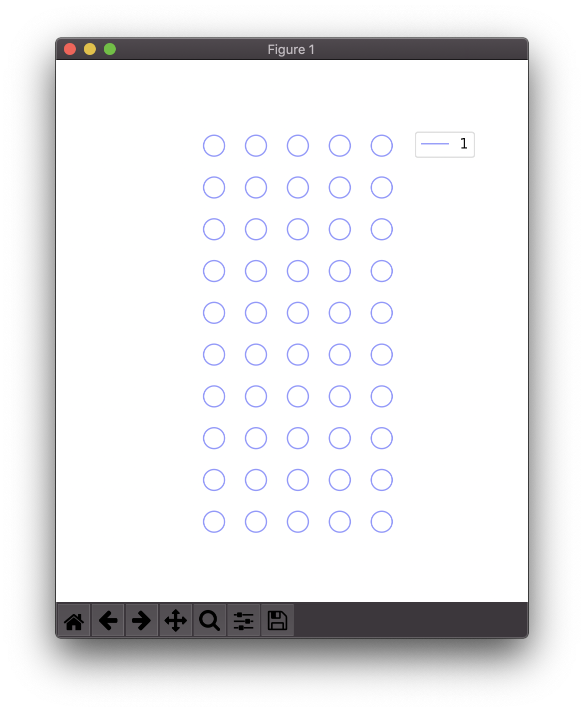
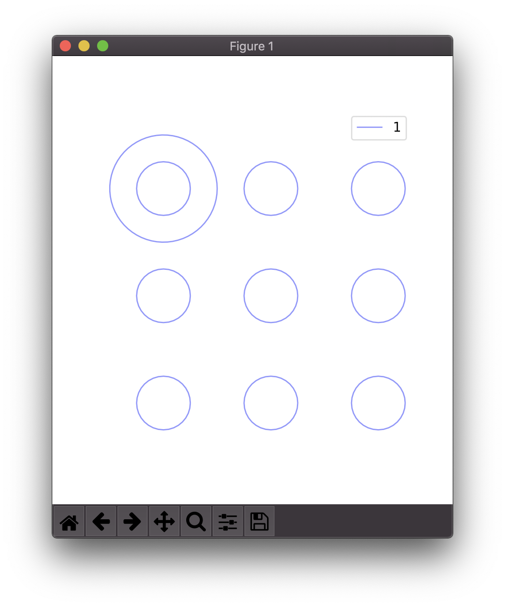

============
Fundamentals
============

Pipeline
========

Useful output is obtained from *vpype* by composing 'pipelines' of 'commands'. In a given pipeline, geometries are passed from command to command, starting with the first all the way to the last.

.. image:: images/pipeline.svg

Pipelines are created by passing *vpype* with the first command name together with its options and arguments, then the next command name, etc.::

  $ vpype command1 [--option X [...]] [ARG [...]] command2 [--option X [...]] [ARG [...]] ...

The list of every commands is available in from the CLI::

  $ vpype --help
  Usage: vpype [OPTIONS] COMMAND1 [ARGS]... [COMMAND2 [ARGS]...]...

  Options:
    -v, --verbose
    -I, --include PATH  Load commands from a command file.
    -H, --history       Record this command in a `vpype_history.txt` in the
                        current directory.
    -s, --seed INTEGER  Specify the RNG seed.
    --help              Show this message and exit.

  Commands:

    Primitives:
      circle        Generate lines approximating a circle.
      line          Generate a single line.
      rect          Generate a rectangle.

    Operations:
      crop          Crop the geometries.
      linemerge     Merge lines whose endings overlap or are very close.
      ...

Help on each command is also available on the CLI, for example::

  $ vpype circle --help
  Usage: vpype circle [OPTIONS] X Y R

    Generate lines approximating a circle.

    The circle is centered on (X, Y) and has a radius of R.

  Options:
    -q, --quantization LENGTH  Maximum length of segments approximating the
                               circle.
    -l, --layer LAYER          Target layer or 'new'.
    --help                     Show this message and exit.

Lines and layers
================

The geometries passed from command to command is organised as a collection of layers, each containing a collection of paths.

.. image:: images/layers.svg
   :width: 300px

The primary purpose of layers is to create or process files for multi-color plots, where each layer contains geometries to be drawn with the specific pen or color. In *vpype*, layers are identified by a non-zero, positive integer (e.g. 1, 2,...). There can be an arbitrary number of layers, memory permitting.

Each layer consists of an ordered collection of paths. In *vpype*, paths are so-called polylines, or lines made of one or more straight segments. Each path is thus described by a sequence of 2D points. Internally, these points are stored as complex numbers (this is invisible to the user but relevant to :ref:`plugin <plugins>` writers).

Curved paths are not supported *per se*. Instead, everything is linearised into small segments that are small enough to approximate curvature in a way that is invisible in the final plot. For example, the :program:`read` command transforms all curved SVG elements (such as circle or bezier paths) into paths made of segment, using a maximum segment size that may be set by the user (so-called quantization). This design choice makes *vpype* very flexible and easy to develop, with no practical impact on final plot quality, but is the primary reason why *vpype* is not fit to be (and is not meant as) a general-purpose vector data processing tool.

One down-side of using polylines to approximate curved element is the potential increase of output file size. For example, three numbers are sufficient to describe a circle, but 10 to 100 segments may be needed to approximate it sufficiently well for plotting. When this becomes an issue, tuning the quantization parameters and using the :program:`linesimplify` command can help.

Command taxonomy
================

Commands come in 3 different types: *generators*, *layer processors* and *global processors*. Although it is not strictly necessary to use *vpype*, understanding the difference between them help to have a good grasp on how it works, and is very useful if you plan on writing your own :ref:`plug-ins <plugins>`.

.. image:: images/command_types.svg
   :width: 600px

Generators
----------

Generators add new geometries to a target layer, ignoring (but preserving) any content in this layer. Other layers' content is not affected by a generator. They accept a ``--layer TARGET`` option to control which layer should receive the new geometries. By default, the target layer of the previous generator command is used, or layer 1 if the generator is the first. Here is an example::

  $ vpype line --layer 3 0 0 1cm 1cm circle 0.5cm 0.5cm 0.5cm

Both :program:`line` and :program:`circle` are generator commands which both create the type of paths you would expect. In this case, both the circle and the line end up in layer 3. For generators, ``--layer new`` can also be used to generate geometries in the empty layer with the lowest possible identifier.

Here are a few more example of generators (the list is not exhaustive):

* :program:`rect`: generates a rectangle
* :program:`frame`: generates a single-line frame around the existing geometries

Layer processors
----------------

Contrary to generators, layer processors generally do not produce new paths but instead modify existing geometries. Further, they do so on a layer by layer basis. This means that the way a layer processor modifies one layer's content bears no consequences on how it will affect another layer. Let's consider for example :program:`linemerge`. This command looks for paths whose either endings are close to each other (according to some tolerance) and merges them when they are, avoiding costly pen-up/pen-down operations by the plotter. Since :program:`linemerge` is a layer processor, it will only merge paths within the same layer.

Layer processors accept a ``--layer TARGET[,TARGET[,...]]`` option to specify one or more layer on which they should be applies. Here are some examples::

  $ vpype [...] crop --layer 1      0 0 10cm 10cm
  $ vpype [...] crop --layer 1,2,4  0 0 10cm 10cm
  $ vpype [...] crop --layer all    0 0 10cm 10cm

All these commands do exactly what you think they should do. If the ``--layer`` option is omitted, then ``all`` is assumed and layer processors will process every single (existing) layer. Note that if you provide a list of layers, they must be comma separated and without any whitespace.

Here are a few examples of layer processors (the list is non-exhaustive):

* :program:`translate`: apply a translation on the geometries
* :program:`linesort`: sort paths within the layer such as to minimize the distance travelled by the plotter in pen-up position
* :program:`linesimplify`: reduce the number of points in paths which ensuring a specified precision, in order to minimize output file size

Global processors
-----------------

While layer processors are executed multiple times, once for each layer they are applied on, global processors are executed only once and apply globally to all layers. Depending on the command,they may or may not have layer-related parameters, although there is no rule about.

For example, the :program:`write` command uses all layers in the pipeline to generate a multi-layer SVG file. Because they use the geometry center as reference (by default), the :program:`rotate`, :program:`scale`, and :program:`skew` transformation commands are also implemented as global processors, although they accept a `--layer` option which behaves much like layer processors.

Units
=====

Like the SVG format, the default unit use by *vpype* is the CSS pixel, which is defined as 1/96th of an inch. For example, the following command will generate a 1-inch-radius circle centered on coordinates (0, 0)::

  $ vpype circle 0 0 96

Because the pixel is not the best unit to deal with physical supports, most commands understand other CSS units including ``in``, ``cm``, ``mm``, ``pt`` and ``pc``. The 1-inch-radius circle can thus equivalently be generated like this::

  $ vpype circle 0 0 1in

Note that there must be no whitespace between the number and the unit, otherwise they would be considered as distinct CLI arguments.

Internally, units other than CSS pixels are converted as soon as possible and pixels are used everywhere in the code (see :class:`Length`).

Blocks
======

.. image:: images/block.svg
   :width: 600px

Blocks refer to a portion of the pipeline marked by the :program:`begin` and :program:`end` special commands. The command immediately following :program:`begin` is called the *block processor* and controls how many times the block pipeline is executed and what is done with the geometries it produced.

The most commonly used block processor is the :program:`grid` command. It repeatedly execute the block pipeline and arrange the result on a regular NxM grid. For example, this command generates a grid of five by ten 1-inch-diameter circles, spaced every 2 inches in both directions::

  $ vpype begin                     \
        grid --offset 2in 2in 5 10  \
        circle 0 0 0.5in            \
      end                           \
      show

Note: we use backslash to escape the end-of-line in order to highlight the nested structure of blocks and how it emerges as some kind of mini-language.

Here is the result:

Let us break down what happened here. The :program:`begin` and :program:`end` define a block whose processor in the :program:`grid` command. The block pipeline consists of a single :program:`circle` command, which generates a 1-inch-diameter circle centered on 0, 0. This pipeline is executed 50 times (for a 5x10 grid), and their result is translated by the :program:`grid` command by offsets of 2 inches. After the block, the :program:`show` commands displays the result.

Blocks can be nested to achieve more complex compositions. Here is an example::

  $ vpype begin                           \
    grid --offset 8cm 8cm 2 3             \
      begin                               \
        grid --offset 2cm 2cm 3 3         \
        random --count 20 --area 1cm 1cm  \
        frame                             \
      end                                 \
    frame --offset 0.3cm                  \
  end                                     \
  show

And the result:

.. image:: images/random_grid.png
   :width: 400px

When using blocks, it is important to understand that a block pipeline is always executed from a blank state, even if geometries existed in before the block. The block pipeline's result is added to the global (or parent) pipeline only at the end of the block. Consider the following for example (the :program:`ldelete` command deletes the layer passed in argument)::

  $ vpype                           \
      circle --layer 1 0 0 1cm      \
      begin                         \
        grid --offset 2cm 2cm 3 3   \
        ldelete 1                   \
        circle --layer 10 0 0.5cm   \
      end                           \
      show

Before the block, a 1cm-radius circle is added to layer 1. Then, the block pipeline starts by deleting the layer 1 before adding a 0.5cm-radius circle.

Here is the result:

Since the block pipeline is executed from a blank state, the :program:`ldelete` command has no effect and all 10 circles are visible in the output.

Command file
============

Pipelines be quite complex, especially when using blocks, which can become cumbersome in the command-line. To address this, all or parts of a pipeline can be stored in so-called command files which *vpype* can then refer to. A command file is a text file whose content is interpreted as if it was command-line arguments. Newlines and indentation are ignored and useful only for readability. Everything to the right of a ``#`` character is considered
a comment and is ignored.

The nested block example of the previous section can be converted to a command file with the following content::

  # command_file.vpy - example command file
  begin
    grid --offset 8cm 8cm 2 3
      begin
        grid --offset 2cm 2cm 3 3
        random --count 20 --area 1cm 1cm
        frame
      end
    frame --offset 0.3cm
  end
  show

The command file can then be loaded as argument using the `-I` or `--include` option::

  $ vpype -I command_file.vpy

Regular arguments and command files can be mixed arbitrarily::

  $ vpype -I generate_lines.vpy write -p a4 -c output.svg

Finally, command files can also include other command files::

  # Example command file
  begin
    grid --offset 1cm 1cm 2 2
    -I sub_command.vpy
  end
  show

